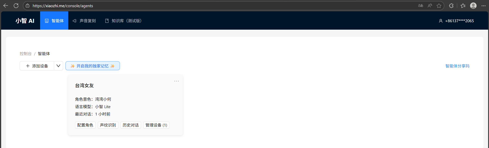
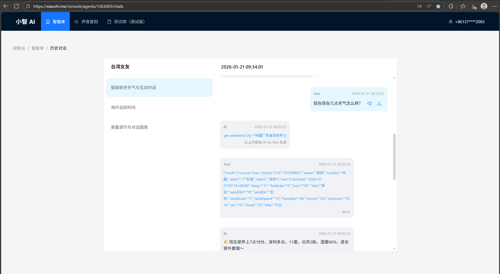

# reSpeaker-Xiaozhi 适配改动说明与部署指南

> **目标**：让设备在启动阶段即可初始化并探测 reSpeaker XVF3800（I2C），并与项目现有的 I2S 音频链路协同工作。
> ---

## 第一部分：reSpeaker 硬件固件准备

本部分操作针对 reSpeaker XVF3800 硬件本身。默认 USB 固件不支持 I²S 输出，因此必须先刷入专门的 I²S 固件，才能与 XIAO ESP32S3 等主机配合使用。

> **注意**：I²S 固件使用 I²C DFU 更新，不支持 USB DFU。若当前已经是 I²S 固件且工作异常，建议先进入「安全模式」，再用 USB DFU 恢复或切换固件类型。安全模式支持 USB DFU 和 I²C DFU 两种方式更新。
> 更详细的官方说明请参考：
> 
> - [reSpeaker XVF3800 入门指南](https://wiki.seeedstudio.com/cn/respeaker_xvf3800_xiao_getting_started/#%E5%88%B7%E5%86%99-i2s-%E5%9B%BA%E4%BB%B6)
> - [ReSpeaker XVF3800 固件仓库](https://github.com/respeaker/reSpeaker_XVF3800_USB_4MIC_ARRAY/tree/master/xmos_firmwares)

### 1.1 准备工作

#### 硬件准备

- reSpeaker XVF3800 USB 4-Mic Array
- USB Type‑C 数据线（能供电也能传输数据）
- 电脑：Windows / macOS / Linux
- 如已集成 XIAO ESP32S3，确保焊接连接正常（I²S / I²C / 电源）

#### 软件准备（安装 dfu-util）

**Windows:**

1. 下载并解压 `dfu-util`（如 `D:\dfu-util-0.11-binaries\win64\`）。
2. 将 `dfu-util.exe` 所在目录加入系统 PATH。
3. 验证安装：`dfu-util -V`
4. **驱动问题**：**如果 `dfu-util -l` 提示 `LIBUSB_ERROR_NOT_SUPPORTED`，请使用 Zadig 工具将设备驱动替换为 WinUSB。**

**macOS (Homebrew):**

```bash
brew install dfu-util
dfu-util -l
```

**Linux (Debian / Ubuntu / Raspberry Pi OS):**

```bash
sudo apt update
sudo apt install dfu-util
sudo dfu-util -l
```

#### 下载 I²S 固件

- 访问 [GitHub 固件仓库](https://github.com/respeaker/reSpeaker_XVF3800_USB_4MIC_ARRAY/tree/master/xmos_firmwares)。
- 在 `xmos_firmwares` 目录中下载以 `i2s` 开头的 `.bin` 文件（如 `respeaker_xvf3800_i2s_dfu_firmware_v1.0.x.bin`）。

### 1.2 连接与进入 DFU 模式

#### 接线要点

- **务必使用「靠近 3.5mm 耳机插孔」那一侧的 USB‑C 口（XMOS 侧）**连接电脑，不要连到 XIAO 那一侧。

#### 进入安全模式（推荐）

适用于：当前是 I²S 固件想换回 USB、固件异常、误刷错误固件。

1. 彻底断开电源。
2. 按住板上的「静音按钮（Mute）」。
3. 重新接上电源（保持按住）。
4. 当红色 LED 开始闪烁时，松开按钮，即已进入安全模式。

### 1.3 使用 dfu-util 刷入 I²S 固件

#### 确认设备可见

```bash
# Linux / Raspberry Pi OS
sudo dfu-util -l
# macOS / Windows
dfu-util -l
```

预期输出应包含 `Found DFU: [2886:001a] ... alt=1, name="reSpeaker DFU Upgrade"`。

#### 执行刷写命令

```bash
# Linux / Raspberry Pi OS（注意替换路径）
sudo dfu-util -R -e -a 1 -D /path/to/respeaker_xvf3800_i2s_dfu_firmware_v1.0.x.bin
# macOS / Windows（无需 sudo）
dfu-util -R -e -a 1 -D /path/to/respeaker_xvf3800_i2s_dfu_firmware_v1.0.x.bin
```

参数说明：`-R` (重启), `-e` (擦除), `-a 1` (刷入Upgrade分区), `-D` (指定固件)。

### 1.4 验证与常见问题

#### 验证固件

刷写完成后，设备会自动重启。此时 I2S 固件已生效。后续可以通过 ESP32S3 读取 I2S 音频数据来验证。

#### 常见问题 (FAQ)

- **Q: `dfu-util -l` 看不到设备？**
  - 检查 USB 线和接口（必须用 XMOS 侧）。
  - 如果是 I²S 固件，必须进入“安全模式”才能刷写。
  - Windows 用户检查 WinUSB 驱动。
- **Q: 刷写中途报错？**
  - 尝试更换 USB 线或主机接口，进入安全模式重试。
- **Q: 刷完后没声音？**
  - 检查 I2S 主机配置（采样率、声道）是否匹配固件定义。

---

## 第二部分：Xiaozhi 软件适配改动

本部分面向开发者，说明为了让 Xiaozhi 项目支持 reSpeaker XVF3800，代码层面做了哪些调整。

### 2.1 改动概览

**核心改动：**

1. **新增共享 I2C 总线封装**：统一管理 I2C Master Bus，避免多模块冲突。
2. **新增启动期硬件探测**：在应用启动前通过 I2C Probe XVF3800，确保硬件在线。
3. **板级配置解耦**：通过 `config.h` 宏定义引脚与地址，便于移植。
4. **构建系统更新**：将新增的 BSP 源文件纳入编译。

### 2.2 关键代码变更点

#### A. 新增：共享 I2C 总线

- **文件**：`main/shared_i2c_bus.h` / `main/shared_i2c_bus.c`
- **功能**：提供 `shared_i2c_master_bus_get()` 接口，使用 ESP-IDF 新式 I2C Master API，默认开启内部上拉。

#### B. 新增：reSpeaker 音频硬件初始化

- **文件**：`main/audio_bsp.c`
- **函数**：`audio_hardware_init()`
- **逻辑**：获取共享 I2C bus，调用 `i2c_master_probe()` 探测 `XVF3800_I2C_ADDR` (0x2C)，并打印探测日志。

#### C. 修改：启动顺序

- **文件**：`main/main.cc`
- **变更**：在 `Application::GetInstance().Start()` **之前**调用 `audio_hardware_init()`。

#### D. 修改：构建系统与板级配置

- **CMakeLists.txt**：新增 `audio_bsp.c` 和 `shared_i2c_bus.c`。
- **boards/xiao-esp32s3-sense/config.h**：
  - 新增 `I2C_SDA_PIN` (5), `I2C_SCL_PIN` (6)。
  - 新增 `XVF3800_I2C_ADDR` (0x2C)。
  - 补齐 I2S 引脚与位宽设置。

---

## 第三部分：编译、烧录与部署

本部分指导如何将适配好代码的固件编译并烧录到 ESP32S3。

### 3.1 硬件连接确认

确保 ESP32S3 与 reSpeaker XVF3800 的连接正确：

- **I2S 音频链路**：连接正常。
- **I2C 控制链路**：ESP32S3 GPIO5(SDA)/GPIO6(SCL) 对应连接到 XVF3800。

### 3.2 配置编译目标

```bash
idf.py set-target esp32s3
```

### 3.3 Menuconfig 配置

```bash
idf.py menuconfig
```

需修改以下配置：

1. **选择板型**：
   `Xiaozhi Assistant -> Board Type -> Seeed Studio XIAO ESP32S3 Sense`
2. **避免引脚冲突（重要）**：
   若 I2S 占用 GPIO43/44，建议将日志输出改为 USB：
   `Component config -> ESP System Settings -> Channel for console output -> USB Serial/JTAG`
3. **Flash 配置**：
   `Serial flasher config -> Flash size -> 8 MB`
   `Partition Table -> Custom partition CSV file -> partitions/v1/8m.csv`

### 3.4 编译与烧录

```bash
idf.py build
idf.py flash
```

### 3.5 查看日志与验证

```bash
idf.py monitor
```

---

## 第四部分：网络配置与激活

固件烧录成功后，需进行网络配置和云端绑定才能正常使用 AI 对话功能。

### 4.1 连接设备热点

1. 手机搜索并连接名为 **Xiaozhi-XXXXXX** 的 Wi-Fi。
2. 浏览器访问配置页面：`http://192.168.4.1`

### 4.2 配置 Wi-Fi

1. 在配置页面等待 5 秒左右扫描网络。
2. 选择你要连接的 **2.4G Wi-Fi**（iPhone 热点需开启“最大兼容性”）。
3. 输入密码，点击 **“连接”**。
4. 显示 **“登录成功”** 后，设备将在 3 秒后自动重启。
   
   

### 4.3 添加新设备到管理后台

1. **获取设备 ID**：联网后，唤醒设备说“你好，小智”，听取播报的 **6 位数字验证码**。
2. **登录后台**：电脑访问 [https://xiaozhi.me](https://xiaozhi.me) 并注册/登录。
3. **绑定设备**：在“智能体”模块选择 **“添加设备”**，输入 6 位设备 ID 并提交。
   
   完成以上所有步骤后，你的 reSpeaker-Xiaozhi 设备即可正常工作。
   
