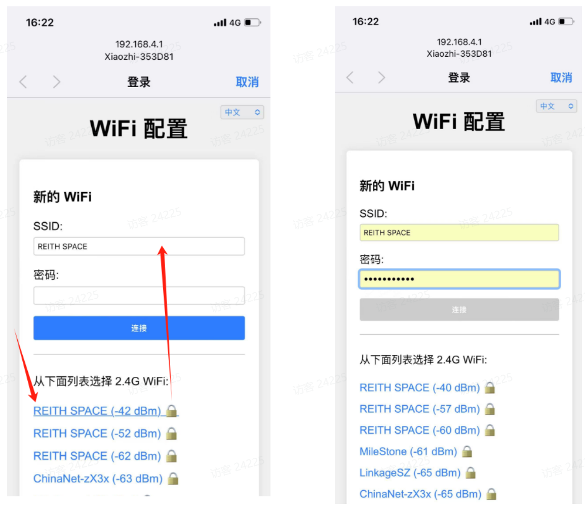
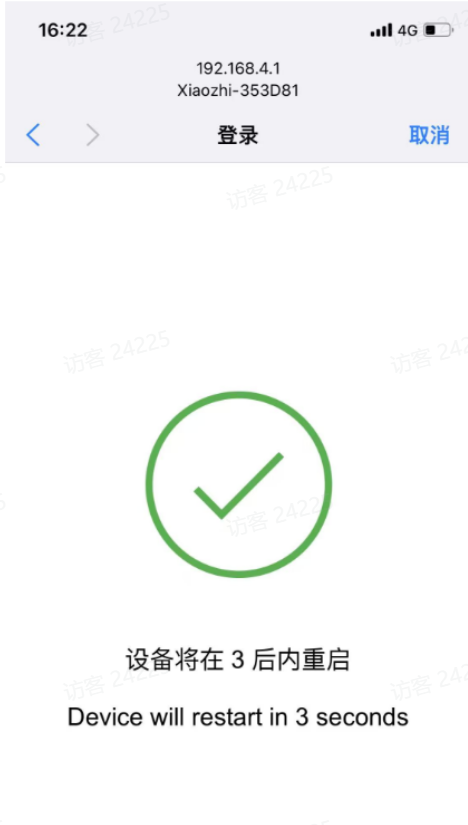
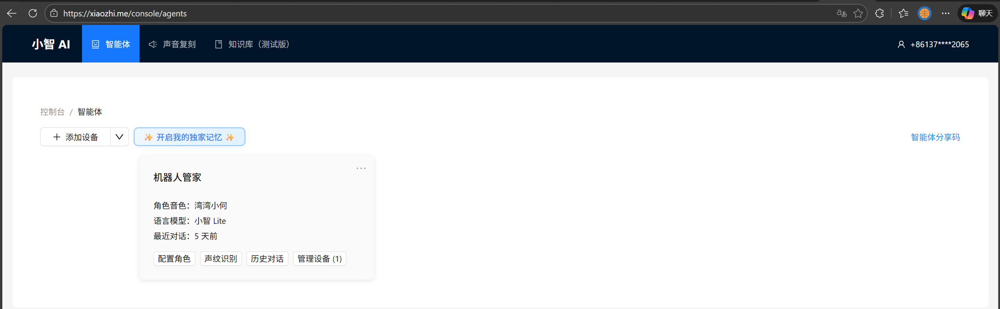

# Hand-by-hand guide: Build your cloud AI Xiaozhi voice assistant using ESP32S3 + reSpeaker

> Goal: Make ESP32S3 work with the reSpeaker XVF3800 and run the Xiaozhi assistant leveraging cloud large-models.
> Project source: https://github.com/Seeed-Projects/Xiaozhi_Esp32S3_reSpeaker
> Seeed-Projects: https://github.com/Seeed-Projects

reSpeaker XVF3800 is a professional 4-microphone circular array based on the XMOS XVF3800 chip. It provides reliable voice pickup in noisy environments with features including dual modes, 360° far-field pickup (up to 5 m), acoustic echo cancellation (AEC), automatic gain control (AGC), direction of arrival (DoA), dereverberation, beamforming and noise suppression. With its robust capture and denoising abilities, Xiaozhi gets a much better "ear".


---

## Part 1: reSpeaker hardware firmware preparation

This section targets the reSpeaker XVF3800 hardware itself. The default USB firmware does not support I2S output, so you must flash a dedicated I2S firmware to use it with hosts such as XIAO ESP32S3.

> Note: The I2S firmware uses I2C DFU (not USB DFU). If the device already has I2S firmware but behaves abnormally, enter "safe mode" first and then use USB DFU to recover or switch firmware. Safe mode supports both USB DFU and I2C DFU.
> See official references:
> - [reSpeaker XVF3800 Getting Started](https://wiki.seeedstudio.com/respeaker_xvf3800_xiao_getting_started/)
> - [reSpeaker XVF3800 firmware repo](https://github.com/respeaker/reSpeaker_XVF3800_USB_4MIC_ARRAY/tree/master/xmos_firmwares)
> - [reSpeaker code repo](https://github.com/respeaker)

### 1.1 Preparation

#### Hardware

- reSpeaker XVF3800 USB 4-Mic Array
- USB Type-C data cable (power + data)
- Computer: Windows / macOS / Linux
- If integrated with XIAO ESP32S3, ensure proper soldering for I2S / I2C / power connections

#### Software (install dfu-util)

Windows:

1. Download and unzip a `dfu-util` binary (e.g. `D:\dfu-util-0.11-binaries\win64\`).
2. Add the directory containing `dfu-util.exe` to PATH.
3. Verify with `dfu-util -V`.
4. If `dfu-util -l` returns `LIBUSB_ERROR_NOT_SUPPORTED`, use Zadig to replace the device driver with WinUSB.

macOS (Homebrew):

```bash
brew install dfu-util
dfu-util -l
```

Linux (Debian / Ubuntu / Raspberry Pi OS):

```bash
sudo apt update
sudo apt install dfu-util
sudo dfu-util -l
```

#### Download the I2S firmware

- Visit the firmware repo: https://github.com/respeaker/reSpeaker_XVF3800_USB_4MIC_ARRAY/tree/master/xmos_firmwares
- Download a `.bin` file with a name starting with `i2s` (e.g. `respeaker_xvf3800_i2s_dfu_firmware_v1.0.x.bin`).

### 1.2 Connect and enter DFU mode

#### Wiring note

- Use the USB-C port near the 3.5mm headphone jack (the XMOS side) when connecting to your computer; do NOT use the XIAO side port.

#### Enter safe mode (recommended)

Use this when: current firmware is I2S but you want USB, firmware is corrupted, or wrong firmware was flashed.

1. Completely remove power.
2. Hold the onboard "Mute" button.
3. While holding it, reconnect power.
4. When the red LED starts blinking, release the button — the device is now in safe mode.

### 1.3 Flash the I2S firmware using dfu-util

#### Confirm the device is visible

```bash
# Linux / Raspberry Pi OS
sudo dfu-util -l
# macOS / Windows
dfu-util -l
```

Expected output contains `Found DFU: [2886:001a] ... alt=1, name="reSpeaker DFU Upgrade"`.

#### Flash command

```bash
# Linux / Raspberry Pi OS (replace path)
sudo dfu-util -R -e -a 1 -D /path/to/respeaker_xvf3800_i2s_dfu_firmware_v1.0.x.bin
# macOS / Windows (no sudo)
dfu-util -R -e -a 1 -D /path/to/respeaker_xvf3800_i2s_dfu_firmware_v1.0.x.bin
```

Parameters: `-R` (reset/restart), `-e` (erase), `-a 1` (write to Upgrade alt), `-D` (firmware file).

### 1.4 Verification & troubleshooting

#### Verify firmware

After flashing, the device will auto-reboot and I2S firmware should be active. You can verify by reading audio data from the device with the ESP32S3 as the I2S host.

#### FAQ

- Q: `dfu-util -l` doesn't show the device?
  - Check USB cable and port (must use the XMOS-side connector).
  - If the device currently runs I2S firmware, enter safe mode before flashing.
  - Windows users: ensure WinUSB driver via Zadig.
- Q: Error during flashing?
  - Try a different USB cable or host port, and retry in safe mode.
- Q: No audio after flashing?
  - Verify I2S host configuration (sample rate, channels) matches the firmware settings.

---

## Part 2: Xiaozhi software adaptation changes

This section addresses code changes to make the Xiaozhi project support the reSpeaker XVF3800.

### 2.1 Overview of changes

Core changes:

1. Added a shared I2C bus wrapper to centrally manage the I2C master and avoid conflicts.
2. Added hardware probe during startup: probe XVF3800 over I2C before application start.
3. Decoupled board-level configuration: use `config.h` macros for pins and addresses to ease porting.
4. Build updates: include the new BSP source files in the build.

### 2.2 Key code change locations

A. New: shared I2C bus

- Files: `main/shared_i2c_bus.h` / `main/shared_i2c_bus.c`
- Purpose: Provide `shared_i2c_master_bus_get()` which uses the ESP-IDF I2C master API with internal pull-ups enabled by default.

B. New: reSpeaker audio hardware initialization

- File: `main/audio_bsp.c`
- Function: `audio_hardware_init()`
- Logic: Acquire shared I2C bus, call `i2c_master_probe()` to detect `XVF3800_I2C_ADDR` (0x2C) and print probe logs.

C. Change: startup order

- File: `main/main.cc`
- Change: Call `audio_hardware_init()` before `Application::GetInstance().Start()`.

D. Change: build & board config

- `CMakeLists.txt`: add `audio_bsp.c` and `shared_i2c_bus.c` to the build sources.
- `boards/xiao-esp32s3-sense/config.h`:
  - Add `I2C_SDA_PIN` (5), `I2C_SCL_PIN` (6).
  - Add `XVF3800_I2C_ADDR` (0x2C).
  - Complete I2S pin and bitwidth settings.

---

## Part 3: Build, flash and deploy

This section guides compiling the adapted firmware and flashing it to the ESP32S3.

### 3.1 Confirm hardware connections

Ensure connections between ESP32S3 and reSpeaker XVF3800:

- I2S audio lines connected correctly.
- I2C control lines connected: ESP32S3 GPIO5 (SDA) / GPIO6 (SCL) to XVF3800.

### 3.2 Select build target

```bash
idf.py set-target esp32s3
```

### 3.3 Menuconfig

```bash
idf.py menuconfig
```

Required adjustments:

1. Select board: `Xiaozhi Assistant -> Board Type -> Seeed Studio XIAO ESP32S3 Sense`.
2. Avoid pin conflicts: if I2S uses GPIO43/44, switch console output to USB:
   `Component config -> ESP System Settings -> Channel for console output -> USB Serial/JTAG`.
3. Flash settings:
   `Serial flasher config -> Flash size -> 8 MB` and
   `Partition Table -> Custom partition CSV file -> partitions/v1/8m.csv`.

### 3.4 Build & flash

```bash
idf.py build
idf.py flash
```

### 3.5 Monitor logs & verify

```bash
idf.py monitor
```

---

## Part 4: Network setup and activation

After flashing, the device needs network configuration and cloud binding to use AI conversation features.

### 4.1 Connect to device hotspot

1. Use your phone to find the Wi-Fi SSID named `Xiaozhi-XXXXXX`.
2. Open a browser and go to `http://192.168.4.1`.

### 4.2 Configure Wi-Fi

1. On the captive portal wait ~5s for network scanning.
2. Choose your 2.4GHz Wi-Fi (iPhone hotspot: enable "Max Compatibility").
3. Enter the password and click "Connect".
4. After "Login successful", the device will reboot in ~3 seconds.
  
  

### 4.3 Add the device to the management backend

1. Get the device ID: after the device is online, wake it by saying "Hello Xiaozhi" and listen for the 6-digit verification code.
2. Go to https://xiaozhi.me and sign up / sign in.
3. In the "Agents" or device management section, select "Add device", enter the 6-digit device ID and submit.
  
  

Once completed, your reSpeaker–Xiaozhi device should be ready and operational.
